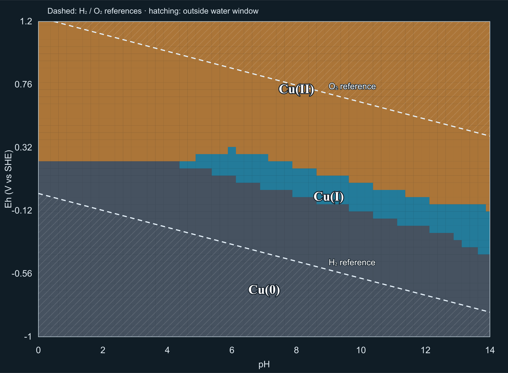

# Generic second-element Pourbaix pipeline and Cu validation

**Recommendation A — READY FOR BOUNDED PUBLIC Cu POURBAIX**, restricted to the contract below and subject to a separate public implementation/review phase. Cu remains absent from the public application import graph. No deployment or remote push was performed.

## Starting baseline

Actual baseline: **458/458 passed**, zero failures, cancellations, skips or todo; duration 306,316.7047 ms. All five official golden cases (acid-base, complexation, precipitation, redox and fixed-activity) passed their existing quantitative tests, and the golden fixture retained its pinned hash. Build and production artifact audit passed. Lint had zero errors and one pre-existing ExpandedPlot.jsx line 21 hook/ref warning. Build retained its existing large-chunk advisory. Baseline files and SHA-256 inventory are in .local/cu-phase/baseline-* and before.json. Production edits began only after this baseline completed.

## Architecture demonstrated with two elements

| Layer | Shared implementation | Element-specific input |
|---|---|---|
| Canonical source chemistry | Existing prepareCanonicalRedoxSession / canonicalRedox | Stable source species IDs and selected basis |
| Metadata resolution | registeredElementOxidation.js | Explicit registry rows, provenance, source fingerprints, version |
| Oxidation-state inventory and predominance | Existing unchanged oxidationInventory.js | Conserved-component identity and explicit allocation |
| Preparation and grid definition | prepareElementCandidate.js | Registry, fixed total and pH/Eh contract |
| Grid orchestration and result branding | boundedPourbaix.js, existing grid.js | Validated contract |
| Point inspection and support assessment | pourbaixContract.js | Metadata/system/phase pins and scope |
| Water context | registeredWaterContext.js, existing waterReferences.js | Same pinned H2/O2 references for both elements |
| Map cells, region representatives and SVG | pourbaixView.js | Display labels, colors and label anchors |
| JSON export | exportPourbaix; bounded-oxidation-pourbaix-v1 | Same generic conservedComponent/totalInventory schema |

Fe's earlier entry points now delegate to these shared implementations. Its public adapter retains its exact setup checks, public branding, legacy totalFe inspection alias and public support version. The public Fe JSON export now uses the common versioned schema (totalInventory and conservedComponent), with its public Fe support claim retained; consumers of the former unversioned export should use this explicit schema. The legacy in-app Fe readout remains compatible. Fe's previous y-axis ticks, label positions, colors and sampled-cell interpretation are preserved.

Cu's production-ready metadata and candidate contract describe science; no Cu-specific grid solver, classifier, predominance algorithm, water calculation or map renderer was added. The Cu research runner calls exactly the same bounded runner that the public Fe adapter calls. Both reject incomplete/unaccepted grids, stale results and metadata/phase mismatches. Both use the same branded, exact equilibrium input/result inspection path. The generic machinery remains bounded to the existing supported ideal, 25 °C, declared 1 bar solver domain; it is not a claim of arbitrary thermodynamic support.

## Source chemistry and curated allocations

The pinned imported source snapshot is 2ac52a30213c9288dd18fc6dd597411e5c3ca53173fa6d1fab5530b371c30a0a. Discovery found 167 source rows involving the two connected Cu source components. Exactly 14 belong to the Cu/H/O/e family; the other 153 require additional components outside this model. Their IDs and excluded components are enumerated in [cu-source-carriers.json](cu-source-carriers.json). No compatible Cu/H/O solid was suppressed.

Canonical basis: **Cu2+, H+, e−, H2O**, with a single conserved analytical Cu inventory. The source's reciprocal Cu2+/Cu+ relations are traced to IDs 97858 and 103398, with the unmodified 2.833 bridge into the Cu2+ basis.

Ten aqueous carriers, including the free canonical ion: Cu2+, Cu+, Cu(OH)2(aq), Cu(OH)2−, Cu(OH)3−, Cu(OH)4²−, Cu2(OH)2²+, Cu3(OH)4²+, CuOH(aq), CuOH+.

Four eligible solid phases: Cu(cr), Cu2O(cr), CuO(cr), Cu(OH)2(cr). The hydroxide is included even though it is not stable at any sampled point. Other ligand chemistry, alloys, nonstoichiometric phases and species absent from the pinned database are outside scope, not silently declared unstable.

The [complete carrier table](cu-source-carriers.md) records source and canonical identities, phase, atom count, explicit allocation, provenance and support. Cu metal is 1 Cu(0); Cu2O is 2 Cu(I); CuO and Cu(OH)2 are each 1 Cu(II). Hydroxo dimers and trimers retain 2 and 3 Cu(II) atoms. The registry is an explicit curated interpretation, not oxidation-state data claimed to have been supplied by the importer. It retains original thermodynamic citations (1997BP-Cu / 2000PT), independent atom assertions, IUPAC-based interpretation and source identity fingerprints. No names, charges alone, display formulas or element associations assign oxidation states at runtime. Source constants were not modified or duplicated into the registry.

Registry: **cu-oxidation-state-metadata-v1**; scope cu-oxide-hydroxide-source-snapshot-v1; SHA-256 628819f67a3122f2ad020bacb71a718f56b9009415d02dfc5a665ae1d9a95b55. This uses the same registry structure, resolver and evidence-pinning philosophy as Fe, with its own versioned content. Missing, ambiguous or changed metadata rejects before solving, including trace candidates and absent solids. There is no unresolved-inventory waiver and no renormalization of incomplete inventory.

## Bounded Cu validation contract

- Total Cu: **0.0001 mol/kg H2O (0.1 mmol/kg)**.
- 25 °C; 1 bar declared; Ideal activity model.
- pH 0–14, step 0.25; Eh −1.0 to +1.2 V vs SHE, step 0.05.
- 57 × 45 = 2,565 points, fixed H+ and electron activity, a(H2O)=1.
- Four solid candidates above; phase scope cu-four-solids-v1; candidate cu-pourbaix-candidate-v1.
- Prepared-system SHA-256 fa745a9d951a38cac972a421932facd4634655ad14203aec20dd7feb9ed47a05.
- H2/O2 are reference overlays only, with unit normalized fugacity/activity; no analytical gas inventory.

The total was selected as a dilute test inventory to exercise Cu aqueous hydrolysis, oxidation-state exchange and solid partitioning. The existing 2e−14 mol/kg closure floor is 2e−10 of this total, below one quarter of the unchanged 1e−8 fraction tie tolerance. This is a numerical and coverage rationale, not a universal environmental concentration or an activity-model validation for arbitrary ionic strengths. This campaign independently compares this total only.

## Cu results

All 2,565 Adam samples converged, classified and closed the full Cu inventory. Unresolved inventory: zero. Maximum Adam closure residual: **1.974603206639225e−17 mol/kg**.

| State | Samples | Representative pH / Eh (V SHE) | Main carrier | Fraction of total Cu |
|---|---:|---|---|---:|
| Cu(0) | 1,179 | 7 / −0.70 | Cu(cr) | 1 at stored precision |
| Cu(I) | 156 | 9 / −0.05 | Cu2O(cr) | 0.9999999729912821 |
| Cu(II) | 1,230 | 8 / +0.70 | CuO(cr) | 0.9999999999998025 |

Cu2O at the representative point has 0.00004999397267744153 mol/kg formula amount and twice that Cu component amount. The remaining dissolved Cu remains in the inventory. Representative exact fractions and carriers are in cu-validation-summary.json; all exact point inspections and accepted equilibria are in cu-pourbaix-samples.json.gz.

Accepted-solid sample counts: Cu(cr) 1,181; Cu2O(cr) 129; CuO(cr) 727; Cu(OH)2(cr) 0. These counts are deliberately different from oxidation-state region counts: a solid can be present without supplying the predominant oxidation-state inventory. Secondary dominant carriers across the grid are Cu(cr) (1,179), Cu2O(cr) (122), aqueous Cu(OH)2− (34), CuO(cr) (727), free Cu2+ (476), and Cu(OH)4²− (27). Thus the classifier is demonstrably not a solid-first labeler.

Predominance remains the largest fraction of total Cu; majority is separately strictly >0.5. Ties use the same symmetric 1e−8 fraction tolerance. The minimum independent top-two margin was 0.029532198831962342; no sampled tie is hidden by ordering.

## Independent official HALTAFALL comparison

All **28** unchanged official library source files were rehashed against the accepted fixture manifest and recompiled locally. Pinned upstream revision: c94b0d8f33fd89eaadcec5a9f3fbf296b6b0e3f7. The small research adapter supplies fixed pH/pe coordinates and total; it does not modify HALTAFALL. The original source Cu reactions were transformed independently into Cu2+/H+/e−/H2O in prepare-cu-reference.mjs, checked against Adam's resulting equations, and fed to the official file reader. Independent aggregation uses its own explicit Cu atom/state table, without importing Adam's metadata or inventory classifier. Both use identical pe values, avoiding an Eh conversion mismatch.

| Metric | Observed |
|---|---:|
| HALTAFALL successful points / zero error flags | 2,565 / 2,565 |
| Oxidation-state classification disagreements | 0 |
| Accepted solid-assemblage disagreements | 0 |
| Maximum Cu species formula concentration difference | 1.9056411722055688e−14 mol/kg |
| Maximum component-weighted concentration / total difference | 1.9056411722055688e−10 |
| Maximum oxidation-state fraction difference | 1.9056400901718007e−10 |
| Maximum HALTAFALL Cu closure residual | 1.905643882711e−14 mol/kg |
| Maximum Adam Cu closure residual | 1.974603206639225e−17 mol/kg |

The observed concentration differences are within the existing 2e−14 component-balance floor at this total; state-fraction differences are below one quarter of the existing tie tolerance. No disagreement required a solver or thermodynamic change. This validates independent numerical solution of the matched source model, not independent experimental validation of every database constant.

Full raw official outputs, independent fractions, source transformation and hashes are retained in cu-haltafall-reference.json.gz. The readable comparison/manifest is cu-haltafall-comparison.json. The production build does not import .local/spana-audit, Java code, research fixtures or Cu modules.

Reproduction (from the project root): run node scripts/validate-cu-pourbaix.js; node scripts/validation/prepare-cu-reference.mjs; compile scripts/validation/PourbaixProbe.java together with the pinned sources in .local/phase4-reference/library/src into .local/cu-phase/classes; run java -Djava.awt.headless=true -cp .local/cu-phase/classes PourbaixProbe .local/cu-phase/matched-cu.dat .local/cu-phase/coordinates.csv 0.0001 and save stdout as .local/cu-phase/haltafall-cu.ndjson; then node scripts/validation/compare-cu-reference.mjs. The source preparation command fails if any pinned library hash differs. The cached official sources are research prerequisites, never production dependencies.

## Water context and actual visual

| State | Below H2 | Inside conventional water window | Above O2 |
|---|---:|---:|---:|
| Cu(0) | 696 | 483 | 0 |
| Cu(I) | 0 | 156 | 0 |
| Cu(II) | 0 | 762 | 468 |

These are contextual flags, not rejected equilibria. No corrosion rate, kinetic persistence, passivation behavior or gas-inventory claim follows.

The [interactive prototype](cu-pourbaix-prototype.html) uses the actual shared-renderer SVG and exported exact point data. Inspection exposes primary state, fractions explicitly relative to total Cu, secondary carrier and the full scientific record. Sample controls and keyboard movement were exercised in the local browser for Cu(0), Cu(I) and Cu(II); adjacent movement from sample 1119 to 1120 correctly changed pH from 9 to 9.25. The SVG was rasterized directly for the PNG; no textbook outline, smoothing or invented boundary was used. SVG cells retain the full sampled grid resolution. Thin intercell rendering seams have no scientific meaning.

## Fe regression and preservation

The complete 2,565-point Fe calculation was rerun through the common runner. Counts remain **422 Fe(0), 581 Fe(II), 1,473 Fe(III), 89 Fe(VI)**. Every stored oxidation-state fraction equals the original accepted evidence exactly: **maximum difference 0**. Its metadata hash, prepared-system identity, seven-solid scope, total, water-reference conventions and public support contract are unchanged. Existing public Fe integration tests also rerun the grid and verify exact beaker/input/result identity, magnetite weighting, ferrate and stale/unsupported gating.

The solver, canonical compiler, thermodynamic source, numerical tolerance contract, original generic oxidation inventory, Fe metadata registry, original Fe evidence and official golden fixtures retain their baseline hashes. Shared wrappers and renderer/export plumbing are the intended production changes. Exact file manifests and final checks accompany this report in cu-phase-checks.json.

## Remaining limitations and review decision

The evidence supports **only this fixed Cu total, source snapshot, phase set and grid at ideal 25 °C / declared 1 bar**. No arbitrary concentration range, other ligands, gas equilibrium, other temperatures, nonideal activities, suppressed-phase model, kinetic interpretation or newly absent database species is supported. Boundaries are sampled cells with ΔpH 0.25 / ΔEh 0.05 V; no local boundary-refinement campaign or exact-root claim was added. A future public implementation must preserve visible phase scope, water assumptions, exact total-denominator readouts and strict result/metadata branding.

The architecture is demonstrably reusable for Fe and Cu without a second engine. It separates conserved-component identity, coordinate conventions, versioned evidence and phase scope in the export/inspection contract. That leaves a path for future overlays or coupled electrochemistry without conflating separate inventories. No overlay, spontaneous-reaction analysis or electrochemical cell UI was implemented.

**A — ready for a separately reviewed bounded public Cu implementation. Public Cu is still disabled. Stop for review.**

## Final verification and exact changed-file list

**468/468 tests passed**; zero failures, cancellations, skips or todo; duration 324,877.1552 ms. All five official golden cases passed unchanged. Build passed (180 modules); artifact audit passed. Lint: zero errors, one pre-existing ExpandedPlot.jsx line 21 hook/ref warning. The unchanged large-chunk build advisory remains. 42 protected source, solver, numerical, metadata and golden/evidence files retained their baseline SHA-256 values.

The full test command used Node's in-process test runner because the desktop environment restricts test-process spawning: node --test --experimental-test-isolation=none src/chemistry/*.test.js src/thermodynamics/*.test.js src/thermodynamics/importers/*.test.js src/thermodynamics/importers/spana/*.test.js src/calculations/*.test.js tests/*.test.js. Build: npm run build -- --configLoader native. Lint: npm run lint. Artifact audit: node scripts/audit-production-boundary.js.

Tracked-purpose project files changed/added (the workspace has no Git repository):

- added: src/analysis/cuOxidationMetadata.js
- added: src/analysis/cuPourbaixContract.js
- modified: src/analysis/fePourbaixContract.js
- modified: src/analysis/feWaterContext.js
- added: src/analysis/pourbaixContract.js
- added: src/analysis/prepareElementCandidate.js
- modified: src/analysis/prepareFeCandidate.js
- added: src/analysis/registeredElementOxidation.js
- modified: src/analysis/registeredOxidation.js
- added: src/analysis/registeredWaterContext.js
- added: src/calculations/boundedPourbaix.js
- modified: src/calculations/publicFePourbaix.js
- modified: src/components/FePourbaixWorkspace.jsx
- modified: src/plots/fePourbaixView.js
- added: src/plots/pourbaixView.js
- added: scripts/validate-cu-pourbaix.js
- added: scripts/validation/compare-cu-reference.mjs
- added: scripts/validation/PourbaixProbe.java
- added: scripts/validation/prepare-cu-reference.mjs
- added: tests/cuPourbaix.test.js
- added: docs/cu-haltafall-comparison.json
- added: docs/cu-haltafall-reference.json.gz
- added: docs/cu-pourbaix-prototype.html
- added: docs/cu-pourbaix-prototype.png
- added: docs/cu-pourbaix-prototype.svg
- added: docs/cu-pourbaix-samples.json.gz
- added: docs/cu-source-carriers.json
- added: docs/cu-source-carriers.md
- added: docs/cu-validation-summary.json
- added: docs/cu-pourbaix-validation.md
- added: docs/cu-phase-checks.json

Generated build output was refreshed in dist. Research-only generated Java classes, matched input files, raw logs, comparison preparation and before/after inventories are isolated under .local/cu-phase; the checks JSON enumerates these separately. Existing .local/spana-audit files and official Java library sources were not modified. No remote action was taken.
