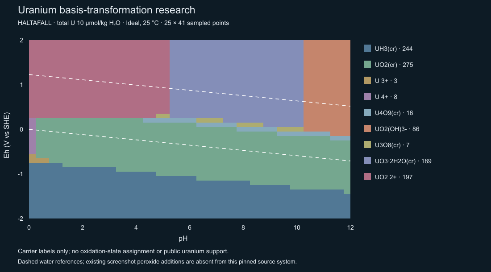

# HYDRA/SPANA component-basis transformation audit

**Recommendation A — HYDRA'S GENERAL BASIS-TRANSFORMATION MECHANISM IS SUFFICIENTLY UNDERSTOOD TO DESIGN AN INDEPENDENT ADAM IMPLEMENTATION.** This conclusion concerns the pinned open-source Java successor's transformation mechanism. It does not establish an exact reproduction of the older Windows screenshot database, and it does not establish uranium oxidation-state support in Adam.

Adam's production source, compiler, solver, thermodynamic data, registries and tests were not edited. Baseline: **480/480 tests passed**, zero failures/cancellations/skips/todo. All five goldens, build and artifact audit pass; lint has the existing ExpandedPlot warning only. Final byte-preservation checks are in [hydra-basis-preservation.json](hydra-basis-preservation.json).

## Evidence and identity

The executed implementation is [ignasi-p/eq-diagr](https://github.com/ignasi-p/eq-diagr/tree/c94b0d8f33fd89eaadcec5a9f3fbf296b6b0e3f7), commit **c94b0d8f33fd89eaadcec5a9f3fbf296b6b0e3f7** (the previous audit's pin). Java `DataBase` identifies itself as HYDRA's successor in its output. The installed Windows Hydra.exe and Medusa.exe both report version 2.00; those executables were neither modified nor treated as byte-identical to the Java code. Their hashes are recorded in the research folder.

The experiment uses the existing accepted Reactions.db, SHA256 **2ac52a30213c9288dd18fc6dd597411e5c3ca53173fa6d1fab5530b371c30a0a**, also found at `C:/Users/adamb/Eq-Diagr/Reactions.db`. Raw record identities below are byte offsets in that file. A separately downloaded DataMaintenance/Reactions.db at the upstream commit has a different hash, **b4ed51c8c2955a042f79815bb2a7015019b90637e33e0eea2643ad38cf7e56a8**; it was not substituted for the accepted dataset in the numerical experiments.

**The screenshot evidence needs correction.** Its selector and total label show **UO2+**, not UO2²+. The local `Uranpourbaix.dat` confirms H+, e−, UO2+ and pH 0–12, but its current final directive is `T, 1`, not the screenshot's 1e−5. It contains 30 soluble products and 11 solids, versus 25 U-bearing dependent carriers plus nine other products in the pinned Java reconstruction. It also contains extra peroxide entries, including UO4 with the explicit comment “Påhittad konstant” (“invented constant”). These entries were not adopted into the research source system or Adam. Both UO2+ and the requested UO2²+ basis were audited. [Input comparison](hydra-screenshot-input-audit.json).

## Actual execution path: four separate stages

| Stage | Code and data | Observed behavior |
|---|---|---|
| A. Selection and discovery | `FrameDBmain.modelSelectedComps`; `ProgramDataDB.elemComp`; `FrameDBmain.searchReactions`; `DBSearch.searchComplexes`, `scanDataBases`, `getOneComplex` | Selected components seed repeated database scans. H2O is admissible even when not selected. Newly discovered redox products that also occur in the element/component catalog become search components. |
| B. Automatic rewriting | `DBSearch.dat`, `selectedComps`, `comps`, `rRedox`; `Complex.reactionComp`, `reactionCoef`, `constant`, `a`, `logKarray` | Every occurrence of a discovered dependent component is replaced by its formation reaction. Coefficients and constants are added with the eliminated coefficient as multiplier. This occurs before writing the chemical-system file. |
| B2. Optional manual exchange | `Spana.ModifyChemSyst` → `ModifyConfirm` → `lib.kemi.readWriteDataFiles.ModifyChemSyst.exchangeComponent` | Exchanges an existing basis component with a chosen reaction product by a pivot/inverse substitution, including division by its coefficient. This is a separate path, not the automatic database search. |
| C. Equilibrium | `ExitDialog.saveDataFile` → `ReadChemSyst` → `Chem.ChemSystem.a/lBeta` and `ChemConcs.kh/tot/logA` → `HaltaFall.haltaCalc` | The solver receives already transformed coefficients and constants. The diagram instructions then decide which components have totals and which have fixed activities. |
| D. Carrier label and drawing | `Predom`, `Plot_Predom` | Predom applies its carrier/solid interpretation and draws sampled regions. It does not create the redox basis or supply discrete oxidation-state metadata. |

Source anchors: [selection/search](https://github.com/ignasi-p/eq-diagr/blob/c94b0d8f33fd89eaadcec5a9f3fbf296b6b0e3f7/DataBase/src/database/FrameDBmain.java#L3490-L3565), [repeated search](https://github.com/ignasi-p/eq-diagr/blob/c94b0d8f33fd89eaadcec5a9f3fbf296b6b0e3f7/DataBase/src/database/DBSearch.java#L151-L429), [admissible reactants](https://github.com/ignasi-p/eq-diagr/blob/c94b0d8f33fd89eaadcec5a9f3fbf296b6b0e3f7/DataBase/src/database/DBSearch.java#L878-L892), [file serialization](https://github.com/ignasi-p/eq-diagr/blob/c94b0d8f33fd89eaadcec5a9f3fbf296b6b0e3f7/DataBase/src/database/ExitDialog.java#L338-L406).

## Algebra: automatic substitution versus manual exchange

Write a formation relation as `log a(P) = kP + Σ vPi log a(i)`. If dependent component D has `log a(D) = kD + Σ vDi log a(i)`, replacing its coefficient m in P gives:

- `kP,new = kP + m kD`
- `vP,new = vP,without D + m vD`

The automatic search uses repeated substitution, **not a matrix inverse or a global least-squares solve**. Its source loop updates `constant += n1 * rcomp.constant` and each coefficient by `n1 * n2`. Analytic temperature coefficients are combined where available; lookup-table values combine with NaNs preserved, and valid temperature/pressure ranges are intersected. Only the 25 °C, 1 bar constants were numerically exercised here. [Transformation implementation](https://github.com/ignasi-p/eq-diagr/blob/c94b0d8f33fd89eaadcec5a9f3fbf296b6b0e3f7/DataBase/src/database/DBSearch.java#L340-L429).

For an independent implementation, collect dependent activities in d and chosen-basis activities in b: `d = k + D d + B b`. Solving `(I − D)` against k and B yields every dependent expression. The new research implementation uses pivoted elimination on those simultaneous equations and retains source-reaction multipliers. It imports no Adam compiler or solver code.

A manual exchange is slightly different. If new basis species X contains q units of old component C, solve `log a(C) = (log a(X) − kX − Σ(other) aXi log a(i))/q`. For a product P, the new X coefficient is `aPC/q`, each other coefficient is `aPi − (aPC/q)aXi`, and its new constant is `kP − (aPC/q)kX`. The inverse row has constant `−kX/q`. The official exchange implementation also applies `round4` to coefficients and multipliers; that rounding is not intrinsic to reaction-space algebra and should not be copied as a scientific default. [Pivot implementation](https://github.com/ignasi-p/eq-diagr/blob/c94b0d8f33fd89eaadcec5a9f3fbf296b6b0e3f7/LibChemDiagr/src/lib/kemi/readWriteDataFiles/ModifyChemSyst.java#L175-L274).

## Reaction-by-reaction evidence

The [three-column transformation table](hydra-basis-transformations.md) contains source reaction → unchanged Java result → independent reconstruction, with byte identities, original and final log K, H+/water/electron coefficients and all source multipliers. The [complete machine-readable evidence](hydra-basis-controls.json) includes every compared product in both uranium bases, Fe and Cu.

Examples in the UO2²+ basis:

| Product | Operations | Final signed formation relation | log K |
|---|---|---|---|
| U4+ | Source byte 346284 already uses this basis | UO2²+ + 4 H+ + 2 e− − 2 H2O → U4+ | 9.038 |
| U3+ | byte 346107 + byte 346284 | UO2²+ + 4 H+ + 3 e− − 2 H2O → U3+ | −9.353 + 9.038 = **−0.315** |
| UO2(cr) | byte 351365 + byte 346284 | UO2²+ + 2 e− → UO2(cr) | 4.85 + 9.038 = **13.888** |
| U3O8 source unit | byte 348696 + byte 346284 | UO2²+ − 1.3333 H+ + 0.6667 e− + 0.6667 H2O → stored solid unit | −6.85 + 9.038 = **2.188** |
| U4O9 source unit | byte 349004 + byte 346284 | UO2²+ − 0.5 H+ + 1.5 e− + 0.25 H2O → stored solid unit | 0.999 + 9.038 = **10.037** |
| UH3(cr) | byte 350096 + byte 346284 | UO2²+ + 7 H+ + 9 e− − 2 H2O → UH3(cr) | −80.1 + 9.038 = **−71.062** |

The U4+ relation introduces 4 H+ and removes 2 H2O. Combining it with UO2(cr)'s source reaction cancels both completely. Nothing in the solver guesses those cancellations. The selected UO2²+ basis itself is an identity, not an extra formation reaction; the mutually inverse UO2+/UO2²+ source relations cancel to log K zero.

**Fractional coefficients are not evidence of a nonstoichiometric compound.** DBSearch stores and combines doubles; it does not rescale the U oxide rows. U3O7 and U3O8 are entered on a one-U basis with finite four-decimal coefficients; their comments are UO2.333 and UO2.667. U4O9 is similarly entered as UO2.25. For example, multiplying the transformed U3O8 row by three would require multiplying its log K by three as well: 6.564. Multiplying U4O9's row by four gives 40.148. Such renormalization was not applied in the comparison.

The rounded source decimals must remain visible: replacing 0.6667 with exactly 2/3 changes the input, however small the difference. The U3O7/U3O8 source hydrogen/water balances have residuals of order 0.0001 because of finite stored coefficients. A future compiler must explicitly handle source precision and reaction units; simply deleting an integer check would not establish scientific support.

## Numerical controls

| Basis | Compared transformed products | Maximum coefficient difference | Maximum log K difference |
|---|---:|---:|---:|
| H+, e−, UO2²+ (+ water column) | 34 | 0 | 0 |
| H+, e−, UO2+ (+ water column) | 34 | 0 | 0 |
| H+, e−, Fe²+ (+ water column) | 28 | 0 | 0 |
| H+, e−, Cu+ (+ water column) | 22 | 0 | 0 |

The counts include non-metal aqueous/gas products found by the same search. Manual exchange of the UO2²+ system to UO2+ also agrees with a fresh automatic UO2+ search: maximum coefficient difference 1.11e−16 and log K difference 8.88e−16.

Secondary control: the unchanged HALTAFALL library solved **1,025/1,025 points in each of four runs** (two bases × official/independent coefficients), total U 1e−5 mol/kg H2O, pH 0–12 in 0.5 steps and Eh −2 to +2 V in 0.1 V steps, Ideal activity, 25 °C, 1 bar, a(H2O)=1. Every error flag is zero. Official versus independent inventories are exactly identical. Across the two different bases, maximum carrier-inventory difference is **1.16242e−14 mol/kg H2O**; there are **zero sampled carrier-label disagreements**. Maximum total-U residual is 1.35e−14, within the unchanged numerical floor.

The research map uses a stated solid-first carrier readout for comparison, not an oxidation-state classifier. It contains the expected U3+/U4+, UO2(cr), U3O8, U4O9, UH3, uranyl/hydrolysis and hydrated-oxide regimes. It does **not** reproduce the screenshot's added peroxide region. That is a dataset/model difference, not a reason to alter the source constants. Boundaries are sampled, not refined.

## Explicit answers to the 18 requested questions

1. **After selecting UO2²+:** H+, e− and that exact component enter the selected list. Electron selection activates redox discovery. Newly admissible component products expand the search, then are eliminated from dependent reactions before output.
2. **Dependent-species discovery:** repeated database scans require every non-negligible reactant to be selected, except water. Element/component associations propose additional component identities; admissible electron-containing formation reactions establish how they are reached. Discovery is more than an element-name match.
3. **Mathematical transformation:** the automatic path performs repeated linear substitution of formation relations. A separate manual component-exchange path uses a pivot, reversal and division. Both are reaction-space linear algebra, but they are not the same execution path.
4. **H+ coefficients:** they are retained and added with signed reaction multipliers. DBSearch has explicit proton bookkeeping in its list-merging implementation; it does not invent an H+ balance from a species name.
5. **H2O:** it is explicit in source vectors and substitutions. Search allows water without requiring user selection. By default the output writer omits the water column; optional `includeH2O` adds it. At unit activity its logarithmic contribution vanishes.
6. **e−:** it is a basis variable in the algebra and a trigger for redox discovery. In this diagram it is later supplied as a fixed log activity, not an analytical electron inventory.
7. **Reversing/scaling/combining:** automatic discovery uses admissible directed source relations and adds multiples of them; it does not synthesize every missing inverse during search. Manual exchange explicitly inverts/scales the selected formation relation. Signs and the constant transform together.
8. **log K:** additive under reaction addition, multiplied under reaction scaling, negated under reversal. Numeric examples and all source multipliers are retained in the transformation table.
9. **Fractional coefficients:** accepted as doubles in automatic search/substitution; no automatic full-formula normalization. Manual exchange rounds to four decimals. Stored finite precision is not silently replaced by exact rational values in this audit.
10. **“Total UO2²+”:** the analytical inventory expressed in units of the chosen uranium-bearing component, including free component, aqueous products and accepted solids weighted by their transformed U coefficient. It is not free uranyl concentration. Normalized solid rows must use their stored coefficient, not the apparent atom count in the display name.
11. **Electron mass balance:** none is imposed here: `kh[e]=2`, `logA[e]=−Eh/(RT ln(10)/F)`. HALTAFALL may calculate a bookkeeping total for an activity-controlled component; that is not a prescribed electron balance.
12. **Proton mass balance:** none is imposed when pH is varied: `kh[H]=2`, `logA[H]=−pH`. Proton coefficients still affect each dependent species' mass action.
13. **Explicit water in transformation:** yes. Its optional omission is a later file/output and activity convention. When included, the reader marks its solvent identity (`jWater`, `noll`); the activity module can calculate water activity in nonideal models. In this isolated Ideal control it is one.
14. **Fe, Cu and U use the same algorithm:** yes for the exercised substitution mechanism. There are nevertheless N/S/P redox-selection options and name-based source-matching/discovery checks. This is not a universal claim that every element and database is scientifically supported.
15. **General linear algebra representation:** yes, `(I−D)` applied to dependent formation equations, or a component pivot for manual exchange. The independently written elimination code matches the executed upstream substitution output.
16. **Why SPANA constructs this U system while Adam refuses:** Adam's present compiler restricts bridges to unit, electron-only exchanges and products to safe integer coefficients. It deliberately rejects the U proton/water bridges and fractional source units. Complete authoritative U oxidation allocations are also absent; HYDRA's ability to rewrite reactions does not supply those allocations.
17. **Smallest correct future generalization:** extend component-expression vectors to retain signed H+/H2O/e− contributions with provenance, while preserving one independently established conserved inventory. Separately introduce explicit source reaction-unit normalization and a justified fractional-coefficient policy. This can stay bounded; a universal chemistry parser is unnecessary.
18. **Required validation:** exact regression of current Fe/Cu systems, alternate-basis invariance, coefficient/constant reconstruction from source multipliers, rank and cycle checks, source-precision/element/charge/inventory checks, water explicit/implicit equivalence at a=1, fractional-unit scaling equivalence, excluded-phase preservation, and independent HALTAFALL point/grid controls. Public U additionally needs authoritative carrier allocations, mixed-valence/hydride interpretation and a maintained support contract.

The constraint meanings are defined in [ChemConcs](https://github.com/ignasi-p/eq-diagr/blob/c94b0d8f33fd89eaadcec5a9f3fbf296b6b0e3f7/LibChemDiagr/src/lib/kemi/chem/Chem.java#L301-L320) and implemented in [HaltaFall](https://github.com/ignasi-p/eq-diagr/blob/c94b0d8f33fd89eaadcec5a9f3fbf296b6b0e3f7/LibChemDiagr/src/lib/kemi/haltaFall/HaltaFall.java#L788-L835). Predom maps T/TV/LTV to kh=1 and LA/LAV to kh=2; two adjacent prose comments in Predom are misleading, so this conclusion follows the assignments and solver contract, not those comments. [Mode mapping](https://github.com/ignasi-p/eq-diagr/blob/c94b0d8f33fd89eaadcec5a9f3fbf296b6b0e3f7/Predom/src/predominanceAreaDiagrams/Predom.java#L2715-L2726).

SPANA's input conversion uses R=8.31446 and F=96485.309, giving **0.05915934523391366 V per pe at 25 °C**. Predom's separate plotting conversion uses F=96484.56. The secondary controls use the input conversion consistently in both bases; this small upstream distinction was not removed or copied into Adam. Adam retains its existing constants. [Input conversion](https://github.com/ignasi-p/eq-diagr/blob/c94b0d8f33fd89eaadcec5a9f3fbf296b6b0e3f7/Spana/src/spana/Select_Diagram.java#L5259-L5279), [SPANA constants](https://github.com/ignasi-p/eq-diagr/blob/c94b0d8f33fd89eaadcec5a9f3fbf296b6b0e3f7/Spana/src/spana/MainFrame.java#L92-L93), [Predom conversion](https://github.com/ignasi-p/eq-diagr/blob/c94b0d8f33fd89eaadcec5a9f3fbf296b6b0e3f7/Predom/src/predominanceAreaDiagrams/Predom.java#L2983).

## Next-phase design only

1. Define a versioned component-expression contract: independent basis IDs, signed coefficient vector, log K, source reaction multipliers, reaction unit and validity domain. Keep metadata interpretation separate.
2. Expand the existing bounded graph expression from an electron scalar to H/e/water vectors. Validate rank and alternate paths; reject inconsistent cycles instead of source-order selection or averaging. Do not rewrite the equilibrium solver.
3. Add a distinct precision/normalization contract for source fractions. Preserve supplied decimal precision, document any justified rational representation, and transform log K and phase amount units together. Do not infer units from display formulae.
4. Prove inversion and basis invariance using this U algebra control, plus existing Fe/Cu exact evidence. Test singular, disconnected, duplicate and contradictory bridges and phase exclusions.
5. Only after algebra and composition contracts pass, curate U oxidation allocations and validate a bounded U support scope independently. Keep public U unavailable until then.

Do not copy the unbounded repeated loop, silent last-record replacement, 0.0001 discovery threshold, four-decimal exchange rounding, legacy formula heuristics, or inconsistent comments as Adam's scientific policy. These are upstream implementation choices, not necessary mathematics. The current research reconstruction reproduces the selected dataset's behavior, not every possible malformed or conflicting upstream database.

## Reproduction and licensing

Isolated folder: `.local/hydra-basis-audit/`. `fetch-source.mjs` retrieves the pinned source; `BasisAudit.java` calls unmodified DBSearch, Complex and LibDB. Its adapter suppresses only UI progress methods and allocates the frame shell without constructing a window. The Java toolkit is allowed for an upstream static initialization; no HYDRA GUI was driven. `reconstruct.mjs` independently solves reaction-space equations. `UraniumControl.java` invokes unchanged HALTAFALL; `ExchangeControl.java` invokes the unchanged manual pivot. `analyze.mjs` compares coefficients, constants and inventories and creates the report evidence/figure.

The upstream headers specify **GPL-3.0-or-later**; the repository includes the GPL v3 text. Pinned upstream source remains isolated with its license, outside the application import graph. No substantial upstream implementation was copied into Adam production. Any future compiler extension should be independently written from the mathematical specification. [License](https://github.com/ignasi-p/eq-diagr/blob/c94b0d8f33fd89eaadcec5a9f3fbf296b6b0e3f7/LICENSE).

Research/report artifacts only. No solver/compiler change, no new thermodynamic constants, no uranium public support, no deployment or remote push. **Stop for review.**
