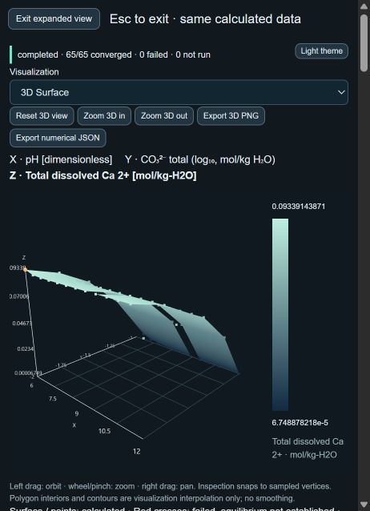

# Independent-variable 2D sweeps and 3D response surfaces

Completed within the existing working tree. No deployment. Mn Pourbaix remains frozen.

1. **Cause of the reported limitation.** No Y/Z alias or order-dependent equilibrium defect could be reproduced. The grid already maps each axis to its own component constraint; output selection derives a separate response after equilibrium. Existing mixed-solubility preparation deliberately rejects grids (`unsupported-mixed-solubility`) and its setup locks the diagram to 1D. The ordinary path also deliberately rejects multiple candidate solids unless explicitly enabled. Those reproducible restrictions prevented the audited mixed example from reaching 2D/3D. They do not establish the cause of an unspecified historical Y/Z-looking plot. This phase adds a separate grid opt-in, preserving both previous restrictions/defaults for existing workflows.

2. **Independent inputs demonstrated.** Every one of 110 grid cells was checked against manually constructed pH/carbonate constraints, followed by a fresh standalone point solve. Water log activity remains zero; mixed Ca and Mg totals stay 0.1 and 0.001 mol/kg-H2O. The physical constraints, concentrations, log activities, solid states and requested Z agree exactly. There are no continuation guesses in `runGrid`; each point starts independently. Display normalization maps chemical X/Z/Y onto the graphics engine's horizontal/vertical/depth axes without changing the chemical identities.

3. **First chemistry.** Bundled carbonate acid/base speciation, explicit CO3 2-/H+/H2O basis, with compatible aqueous CO2, H2CO3, HCO3- and OH-. No gas phase, invented constants or fitted reference surface.

4. **Exact axes and response.** First case: X = pH 4–12, 9 samples; Y = log10(total carbonate / mol kg-1 H2O), -6 to -2, 5 samples; Z = log10(HCO3- molality / mol kg-1 H2O). Y is an analytical component total, Z is the separately calculated bicarbonate species concentration. Second case: X = pH 6–12, 13 samples; Y = log10(total carbonate / mol kg-1 H2O), -2 to -1, 5 samples; Z = total dissolved Ca in mol/kg-H2O. Both use the existing ideal model, 25 °C, declared 1 bar and water activity 1. These examples are available in Calculation setup and enter the existing results workflow.

5. **Analytical, slice and direct checks.** For the carbonate case, with h = 10^-pH and source formation coefficients, free carbonate is T_C / (1 + sum(beta_j * h^nu_H,j)) over carbonate-containing aqueous products. Bicarbonate follows its own source mass-action equation. All 45 values agree; maximum absolute log-output difference is 3.552713678800501e-15. All 65 mixed dissolved-Ca values match direct stoichiometric reconstruction exactly. Independent calcite/brucite closed-form checks from the earlier audit at total carbonate 0.1 and pH 10.5, 11 and 12 agree under the existing validation criteria. That check uses equal supplied Ca/C totals, both solid saturation equations and the cancellation of equal Ca/C contributions; it does not call the point solver. Three independently rerun constant-Y pH sweeps and three constant-X carbonate sweeps pass for **each** case. Simple slices: Y=-6,-4,-2 and X=4,8,12. Mixed slices: Y=-2,-1.5,-1 and X=6,9,12. Every slice output and accepted equilibrium state agrees exactly with the grid. The comparison criteria reuse existing analytical tolerances; solver tolerances are unchanged.

6. **Traversal.** Row-major baseline, column-major (swap grid axes, restore physical coordinate identities for comparison), reversed X and reversed Y all produce identical accepted states and Z at matching physical coordinates. Storage remains explicitly x-fast row-major; no transpose or reverse changes scientific meaning.

7. **Missing points and unresolved continuity.** Unaccepted points retain their typed diagnostics and null response. Cancelled/unrun samples stay null; invalidated-stale runs are rejected by output derivation. Old retained results keep their old conditions/revision. Any missing or unavailable corner removes the entire mesh quad. Surface and base contours use the same missing/transition mask. Additionally, when adjacent accepted samples have different active solid assemblages, the 3D mesh leaves that quad open while retaining every valid vertex. These are explicitly labeled **unresolved continuity intervals**, not failed points, proven discontinuities or located phase boundaries. No general discontinuity detector was invented: finite sampling cannot establish continuity or locate a jump within a same-assemblage cell. Polygon interiors remain graphical interpolation, never additional equilibrium data.

8. **Second realistic case.** The previously audited Ca–carbonate–Mg basis, 11 compatible aqueous products and all ten compatible pure-solid candidates, using the unchanged bounded multi-solid solver. Dissolved Ca = m(Ca2+) + m(CaOH+) + m(CaCO3 aq) + m(CaHCO3+); all four coefficients are one. The implementation sums coefficients over every compatible aqueous row, not a hard-coded species list. Solids are excluded from dissolved totals. Accepted sampled assemblages include calcite, calcite+crystalline Mg(OH)2, and Ca(OH)2+calcite+crystalline Mg(OH)2. This is one coupled mixed equilibrium per coordinate, not independent-system overlays. The response is **total dissolved amount**, not a claim that every possible modified setup is a saturated-solubility diagram.

9. **Nontrivial 3D surface produced.** Yes. Simple case: 45/45 accepted vertices, 64 triangles, Z from -8.355574740889347 to -2.0116914567021844. Mixed case: 65/65 accepted vertices, 84 triangles, six unresolved assemblage-change quads; dissolved Ca from 0.00006748878217612041 to 0.09339143870579028 mol/kg-H2O. Browser checks used the normal setup/load/calculate/results/3D controls for both examples. The mixed view also passed expansion and exact pin inspection: sample 64 is pH 12, Y=-1, dissolved Ca 0.00007106082561748 (display formatted; exact binary-double value remains in the evidence/export). Browser automation briefly timed out during the synchronous mixed solve, but the calculation completed with 65 accepted results; no alternative chemistry or fabricated fallback was used. The captured narrow expanded view is `independent-surface-mixed.png`.

10. **Tests and release checks.** Eight focused tests added; 275 total tests pass, zero failures. Full test, lint, build and production-audit outputs are saved alongside this report. Lint retains the pre-existing ExpandedPlot cleanup warning; build retains the pre-existing large-chunk warning. A final check also covers returning the opt-in grid to System structure review without falsely rejecting its configuration.

11. **Baseline/scientific preservation.** All 267 previous tests and the five unchanged golden benchmarks pass. Golden fixture SHA-256 remains `aefc0949b585ef290595088c8ed852a1eb591be25dff24563a44a2cf98d40960`; bundled database SHA-256 remains `9fa7db6f4a13a88073a0ca214c412690846674f6b3f442e336baf1586c45d245`. No solver equations, constants, tolerances, source stoichiometry, activity/pressure assumptions, existing equilibrium definitions or export precision changed. No Mn topology or other Mn files were edited. The point, multi-solid, sweep, grid and output numerical implementations are unchanged.

12. **Exact files changed in this phase.** Paths are relative to the existing project root `C:/Users/adamb/PycharmProjects/PythonProject/adams-laboratory`.

    Modified production files:
    - `src/App.jsx` — connect the two example loaders.
    - `src/components/CalculationWorkspace.jsx` — compact example actions, explicit opt-in label, clear grid opt-in when leaving grid mode.
    - `src/components/Surface3D.jsx` — pass actual equilibrium outcomes into geometry; explain open assemblage-change cells.
    - `src/solver/prepareSession.js` — separate, explicit multi-solid grid preparation and structure-review handoff; existing one-solid and 1D mixed defaults retained.
    - `src/plots/surface3d.js` — retain all vertices but omit unresolved assemblage-change quads and matching contours.
    - `src/plots/scalarMap.js` — optional excluded-quad argument used by surface contours; ordinary map defaults unchanged.

    Added source/validation files:
    - `src/data/surfaceExamples.js`
    - `scripts/validation/independentSurfaces.js`
    - `scripts/validate-independent-surfaces.js`
    - `tests/independentSurfaces.test.js`

    Added evidence/report artifacts:
    - `docs/independent-surface-carbonate.json.gz`
    - `docs/independent-surface-mixed.json.gz`
    - `docs/independent-surface-mixed.png`
    - `docs/independent-surfaces-tests.txt`
    - `docs/independent-surfaces-lint.txt`
    - `docs/independent-surfaces-build.txt`
    - `docs/independent-surfaces-production-audit.txt`
    - `docs/independent-surfaces-report.md`

    `dist/` was regenerated by the required build. No deployment/configuration changes. This folder has no Git metadata; the file list tracks this phase's explicit edits, not a claim about earlier working-tree changes.

13. **Remaining limitations.** Validation establishes these sampled domains and source basis, not arbitrary grids, nonideal chemistry or general redox closure. The full multi-solid candidate search can block the browser during a chunk; worker/performance redesign was outside scope. This phase does not locate continuous phase boundaries or certify unresolved topology. Conservative open mesh cells may omit continuous kinks as well as possible jumps; they never delete accepted chemical samples. True unsampled discontinuities within unchanged assemblages cannot be excluded by this finite grid. Mn Pourbaix remains frozen, including its unresolved junctions. Existing unsupported outputs remain unavailable. No deployment.

## Reproducible evidence

`node scripts/validate-independent-surfaces.js` regenerates both compressed full-precision JSON captures by rerunning every grid, all standalone points, both slice directions and all traversal variants. The captures retain inputs, output definitions, accepted results, diagnostics, source identities, derived responses and mesh topology. Gzip is lossless; JSON numerical precision is not rounded. The new tests independently exercise repository-to-grid integration and the prior analytical two-solid check as well.

