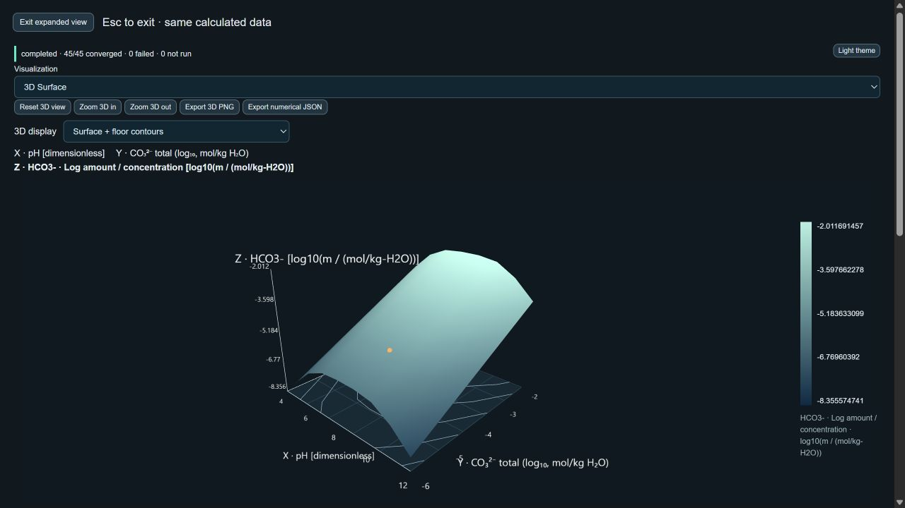
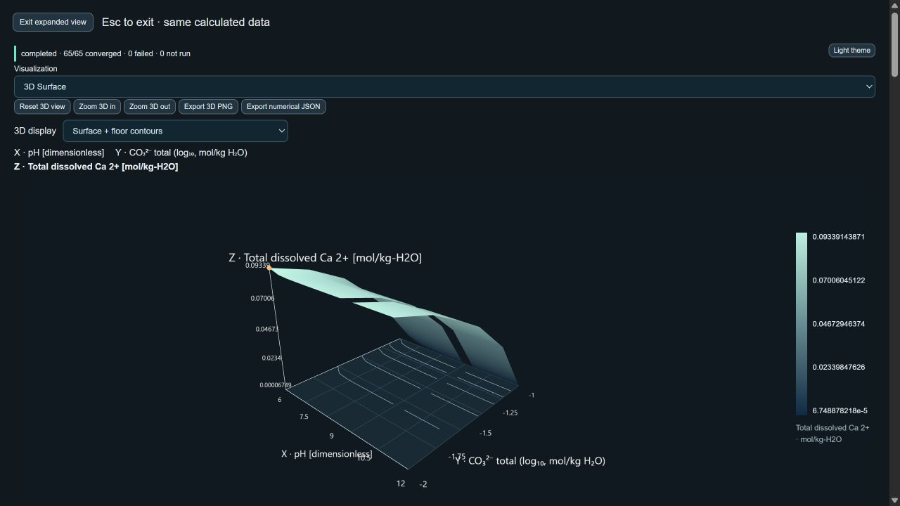

# Two-variable sensitivity audit and scientific response-surface presentation

Completed from the 275-test working tree. No deployment; no changes to Mn Pourbaix, solver equations, thermodynamic constants, tolerances, activity assumptions or pressure assumptions.

1. **Complete numerical independence audit.** The audit ran before rendering changes. Both complete matrices and all unrounded directional statistics are in [mixed matrix](response-matrix-mixed.json) and [carbonate matrix](response-matrix-carbonate.json), with the complete matrices reproduced below. Rows are fixed Y, columns are fixed X; Z[iy][ix] is explicit. Lossless full inputs, results, candidate systems and reciprocal traces are in [mixed evidence](response-audit-mixed.json.gz) and [carbonate evidence](response-audit-carbonate.json.gz).
2. **Actual X/Y variation.** The mixed Ca grid is strongly carbonate-sensitive, not Y-invariant: fixed-pH carbonate ranges are 0.07130423133648044–0.0899381029539873 mol/kg-H2O. Fixed-carbonate pH ranges are 0.004111032796804859–0.022016146543692355 mol/kg-H2O. Median adjacent changes are 0.00001198221868037308 along X and 0.01846194715902743 along Y. Maximum adjacent changes are 0.018630299574065493 and 0.043704015466927475 respectively. The response is genuinely two-dimensional, with uneven sensitivity and broad pH plateaus; different labels were not used as evidence.
3. **Identical rows/columns.** Zero exactly identical rows, columns or pairs; zero effectively identical rows, columns or pairs in either case. Effective equality uses the existing analytical comparison criterion abs(a-b) <= 4e-14 + 2e-10*max(abs(a),abs(b)). This is not a new solver tolerance. Substantial variation is assessed separately with a declared descriptive threshold of 1% of the global Z span per adjacent step. Passing numerical nonidentity alone is not considered substantial chemistry. Relative row/column ranges and global-span-normalized ranges are reported below and in the matrix files. Neither grid has an effectively flat complete row or column.
4. **Actual solver inputs.** Path: CalculationDefinition independentVariables → createGridDefinition coordinate arrays → runGrid applies each axis's own toSourceInput → createPointInput validates/reorders constraints → solvePoint → deriveGridOutputs derives Z from the accepted state. Y becomes a carbonate analytical total of 10^Y, not plot metadata. X becomes controlled proton log activity -pH. The reciprocal low/middle/high traces below include the actual ordered constraints, accepted Z, active solids and mass-balance residuals. Each evidence trace also retains the entire candidate ChemicalSystem, source records, prepared input, concentrations, component totals, saturation statuses and diagnostics. Mixed fixed Ca=0.1 and Mg=0.001 mol/kg-H2O; water log activity=0; ideal, 25 °C, declared 1 bar; multi-solid policy bounded-multisolid-v1. pH is externally controlled, not charge-closure inferred.
5. **Independent points.** Every grid point (65 mixed, 45 carbonate), including the requested reciprocal three-point selections, was freshly prepared with manually constructed constraints outside runGrid and solved independently. Accepted status, aqueous concentrations, log activities, active/inactive solids and mass-balance residual arrays agree exactly; maximum differences are zero. Z also agrees with independent stoichiometric reconstruction (mixed) or analytical carbonate mass action (carbonate, maximum absolute log-output difference 3.552713678800501e-15). All original scientific acceptance criteria remain intact.
6. **1D slices.** Six independent 1D sweeps per system, not merely extracted grid slices. Mixed fixed Y=-2,-1.5,-1; fixed X=6,9,12. Carbonate fixed Y=-6,-4,-2; fixed X=4,8,12. Every available Z point and accepted scientific state agrees exactly: maximum slice Z residual=0 and maximum compared state-array difference=0.
7. **Traversal.** Fresh row-major, column-major (transposed axes then matched by physical coordinates), reversed X, reversed Y and both axes reversed all agree exactly in corresponding accepted states, phase assemblages, balances and Z. Maximum differences=0. The existing grid does not carry continuation guesses between points. A transpose affects storage/orientation, not equilibrium meaning.
8. **Original case assessment.** The mixed Ca–carbonate case is valid and two-dimensional. It is a poor balanced visual sensitivity demonstration over this particular domain: only 9/60 adjacent pH steps exceed 1% of its global Z span, versus 51/52 carbonate steps. Nothing was stretched, logarithmically transformed or chemically altered to make this Ca surface look more curved. It remains available with its original axes, ranges, output and six open assemblage-transition cells.
9. **Clearer demonstration.** Use the already supported carbonate acid/base example: X=pH 4–12; Y=log10 analytical carbonate total from -6 to -2; Z=log10 bicarbonate molality, a different species response. No new chemistry, source records or constants were introduced. Its pH profile is analytically checked; proportionality of bicarbonate to analytical carbonate is chemically expected under this ideal restricted basis. It is a separable response, not evidence of nonlinear X/Y interaction, but neither input is interchangeable with Z.
10. **Substantial two-axis response.** Bicarbonate spans 2.343883284187161–2.3438832841871644 log units along every fixed-Y row and 4–4.000000000000002 log units along every fixed-X column. Median adjacent changes: X=0.5066419708497261 log units, Y=1 log unit. 35/40 X steps and 36/36 Y steps exceed the declared 1%-of-global-span screen. These effects are far above the numerical comparison criterion. A four-log-unit change is a 10,000-fold molality change, not a relative error of a signed logarithm. The range/max-absolute-Z statistic for logarithmic Z is descriptive only; global-span ratios and log-unit/fold changes are the chemically interpretable comparisons.
11. **Gaps/discontinuities.** The previously validated mesh/contour mask is preserved. Failed/unavailable/unrun points create no faces, no invented values and no contour crossings. Adjacent differing active assemblages create unresolved intervals with valid vertices retained and inspectable. These are explicitly distinguished from solver failure and from proven discontinuities. No general discontinuity detector or smooth boundary inference is claimed. The neutral floor is a coordinate guide, not a filled response map or additional chemistry.
12. **Presentation and inspection.** Default is Surface + floor contours. The same quantitative Z values drive height, color and constant-Z floor contours; height is affine-linear in the selected Z output and the floor is the current displayed Z minimum, not necessarily zero. Auto aspect normalizes axes and is explicitly labeled view-only. Other compact modes: Surface + samples; Surface + wireframe; Surface + floor contours + samples; Contours only. Orbit, zoom/reset, expansion and exact export remain. Surface interiors use existing piecewise-linear triangles only within compatible patches. Floor clicks snap to the nearest requested grid sample and explicitly state that no equilibrium occurred at the graphical click location. Surface-interior picks snap to accepted vertices; direct overlay picks identify vertices. Failed requested samples remain selectable for diagnostics without fabricating Z. Full-precision X/Y/Z and selection origin are available in inspection. Full chemical state, species, solids and residuals remain in the existing diagnostics. Temperature sweeping remains unsupported; the reference image provides only a visual concept.
13. **Validation results.** 284 tests pass (275 previous + 9 new); no failures. Focused audit tests pass; 22 existing surface-related tests also pass after the final presentation refinements. Full suite, lint, build and production audit pass. Only the existing ExpandedPlot hook warning and large-bundle build warning remain. Logs are response-tests.txt, response-renderer-tests.txt, response-lint.txt, response-build.txt and response-production-audit.txt.
14. **Baseline preserved.** All 275 previous tests and five golden benchmarks pass unchanged. The fixture hash remains aefc0949b585ef290595088c8ed852a1eb591be25dff24563a44a2cf98d40960; the bundled database hash remains 9fa7db6f4a13a88073a0ca214c412690846674f6b3f442e336baf1586c45d245. No scientific production computation, grid definition, source constant, multi-solid formulation, tolerance or exact numerical export data was modified in this phase.
15. **Exact files changed.** Modified: src/App.css; src/components/Surface3D.jsx; src/components/SurfaceControls.jsx; src/plots/threeSurfaceRenderer.js. Added: src/plots/responseSurface.js; scripts/validation/responseAudit.js; scripts/audit-response-surfaces.js; tests/responseAudit.test.js. Added evidence/report: docs/response-audit-mixed.json.gz; docs/response-audit-carbonate.json.gz; docs/response-matrix-mixed.json; docs/response-matrix-carbonate.json; docs/response-audit-log.txt; docs/response-tests.txt; docs/response-renderer-tests.txt; docs/response-lint.txt; docs/response-build.txt; docs/response-production-audit.txt; docs/response-surface-carbonate.png; docs/response-surface-mixed.png; docs/response-surface-report.md. dist/ regenerated by the required build; no deployment or configuration change. This folder has no Git metadata, so this list tracks explicit edits in this phase rather than previous work.
16. **Limitations.** Sampled sensitivity is not a guarantee of arbitrary-domain behavior or a complete continuous derivative map. The Ca response retains real plateaus; the bicarbonate response is separable. Constant-temperature ideal chemistry only. Unresolved phase-transition cells stay open and can also omit continuous kinks. Finite sampling cannot exclude hidden discontinuities within a same-assemblage patch. Contours are graphical interpolation, not new solver points. Narrow screens require orbit/zoom and may show less axis-label space. Multi-solid calculations still execute synchronously in chunks; worker/performance redesign is out of scope. No Pourbaix/beaker/coulometry work or deployment.

## Browser verification

The unchanged 45-point carbonate example entered Results and 3D through normal UI controls. All five modes kept the same grid ID, revision, 45 samples and 64 possible mesh triangles; floor/sample overlay flags changed as requested. Contours-only floor selection at an off-vertex location snapped to sample 14 (pH 9, Y=-5) and displayed its calculated Z=-5.020922591787423 with a floor-projection notice. Expansion and return to setup preserved the original data. The original mixed example was also recalculated and inspected with the new presentation; it retains its 65 accepted samples and six open transition cells. Screenshots are linked below.

## Directional statistics and actual solver-entry traces

### Mixed Ca–carbonate–Mg


Vary X at fixed Y

| Fixed coordinate | min Z | max Z | range | range/max abs Z | range/global span |
|---|---|---|---|---|---|
| -2 | 0.07137529216209793 | 0.09339143870579028 | 0.022016146543692355 | 0.2357405223518347 | 0.2359110020708791 |
| -1.75 | 0.07137529216209758 | 0.08582984484798829 | 0.014454552685890715 | 0.16840940015085562 | 0.15488577902801795 |
| -1.5 | 0.06838282861462232 | 0.07249386141142718 | 0.004111032796804859 | 0.05670870218201452 | 0.044051208721552694 |
| -1.25 | 0.043771504249103595 | 0.04940994014975306 | 0.005638435900649462 | 0.11411541652469785 | 0.060417887426159445 |
| -1 | 0.00006748878217612041 | 0.01606406802185853 | 0.01599657923968241 | 0.9957987738794254 | 0.17140915330711615 |

Adjacent-step metrics: {"count":60,"max":0.018630299574065493,"median":0.00001198221868037308,"aboveOnePercentOfGlobalSpan":9}. Exact duplicate lines: 0; effectively duplicate lines: 0.

Vary Y at fixed X

| Fixed coordinate | min Z | max Z | range | range/max abs Z | range/global span |
|---|---|---|---|---|---|
| 6 | 0.01606406802185853 | 0.09339143870579028 | 0.07732737068393175 | 0.8279920703174417 | 0.8285908466928839 |
| 6.5 | 0.0064819951330467 | 0.09071465664074178 | 0.08423266150769508 | 0.9285452277164271 | 0.9025835444882014 |
| 7 | 0.003044375888997809 | 0.09019222737012446 | 0.08714785148112665 | 0.9662456956905553 | 0.9338208632666892 |
| 7.5 | 0.0015866713760257201 | 0.09006083761524503 | 0.0884741662392193 | 0.982382227191754 | 0.9480328073515489 |
| 8 | 0.0008702229733764152 | 0.09002269756702282 | 0.0891524745936464 | 0.9903332937481848 | 0.9553011275949838 |
| 8.5 | 0.0004903065065985583 | 0.0900109781834333 | 0.08952067167683474 | 0.9945528143733826 | 0.9592464929967879 |
| 9 | 0.00028433525099036817 | 0.09000730630906409 | 0.08972297105807372 | 0.9968409758868461 | 0.9614142043013841 |
| 9.5 | 0.00017460118629830602 | 0.09000614840120753 | 0.08983154721490923 | 0.9980601193429586 | 0.962577637234992 |
| 10 | 0.00011689277931591786 | 0.09000577394713064 | 0.08988888116781471 | 0.9987012746606169 | 0.9631919913525836 |
| 10.5 | 0.000081602184152827 | 0.09000563899135679 | 0.08992403680720396 | 0.9990933658705465 | 0.9635686967901268 |
| 11 | 0.00006991771751778914 | 0.09000560130086503 | 0.08993568358334725 | 0.9992231848184197 | 0.9636934962242788 |
| 11.5 | 0.00006748878217612041 | 0.09000559173616342 | 0.0899381029539873 | 0.9992501712296503 | 0.9637194206589178 |
| 12 | 0.00007106082561748219 | 0.07137529216209793 | 0.07130423133648044 | 0.999004405817967 | 0.7640507221869959 |

Adjacent-step metrics: {"count":52,"max":0.043704015466927475,"median":0.01846194715902743,"aboveOnePercentOfGlobalSpan":51}. Exact duplicate lines: 0; effectively duplicate lines: 0.

Actual reciprocal solver-entry traces (all accepted; quantities below use source molality and log-activity conventions):

| pH | plotted Y | actual carbonate total | actual H log activity | Z | active solids | max abs component balance residual |
|---|---|---|---|---|---|---|
| 9 | -2 | 0.01 | -9 | 0.09000730630906409 | CaCO3(cr) = 0.009992693690935951 | 2.7755575615628914e-17 |
| 9 | -1.5 | 0.03162277660168379 | -9 | 0.0683848011743329 | CaCO3(cr) = 0.03161519882566711 | 1.3877787807814457e-16 |
| 9 | -1 | 0.1 | -9 | 0.00028433525099036817 | CaCO3(cr) = 0.09971566474900964 | 4.336808689942018e-19 |
| 6 | -1.5 | 0.03162277660168379 | -6 | 0.07249386141142718 | CaCO3(cr) = 0.02750613858857283 | 6.938893903907228e-18 |
| 9 | -1.5 | 0.03162277660168379 | -9 | 0.0683848011743329 | CaCO3(cr) = 0.03161519882566711 | 1.3877787807814457e-16 |
| 12 | -1.5 | 0.03162277660168379 | -12 | 0.06838283332699639 | Mg(OH)2(cr) = 0.0009996721622232186; CaCO3(cr) = 0.031617166673007936 | 4.3298697960381105e-15 |

Basis/free components: Ca 2+, CO3 2-, Mg 2+, H+, H2O. Aqueous reaction products: H2CO3, HCO3-, Mg4(OH)4+4, MgCO3, MgHCO3+, MgOH+, OH-, CaCO3, CaHCO3+, CaOH+, CO2. Solid candidates: Mg(OH)2(am), Mg(OH)2(cr), MgCO3(s), MgCO3·3H2O(s), MgCO3·5H2O(s), MgO(cr), Ca(OH)2(cr), CaCO3(am), CaCO3(cr), CaO(cr).

Complete full-precision matrix (row=fixed Y, column=fixed X):

```json
{
  "X": [
    6,
    6.5,
    7,
    7.5,
    8,
    8.5,
    9,
    9.5,
    10,
    10.5,
    11,
    11.5,
    12
  ],
  "Y": [
    -2,
    -1.75,
    -1.5,
    -1.25,
    -1
  ],
  "Z": [
    [
      0.09339143870579028,
      0.09071465664074178,
      0.09019222737012446,
      0.09006083761524503,
      0.09002269756702282,
      0.0900109781834333,
      0.09000730630906409,
      0.09000614840120753,
      0.09000577394713064,
      0.09000563899135679,
      0.09000560130086503,
      0.09000559173616342,
      0.07137529216209793
    ],
    [
      0.08582984484798829,
      0.08297157036385286,
      0.0824185478808937,
      0.08228057692093728,
      0.08224067343274118,
      0.08222842837896994,
      0.08222459347171993,
      0.08222338431212116,
      0.08222299286575725,
      0.08222285097049403,
      0.08222281155754695,
      0.08222280167100306,
      0.07137529216209758
    ],
    [
      0.07249386141142718,
      0.06922406571241536,
      0.06859987461650076,
      0.0684465222560486,
      0.0684024929535722,
      0.06838901766388103,
      0.0683848011743329,
      0.06838347205556213,
      0.06838304083696188,
      0.06838288269905464,
      0.06838283925449777,
      0.06838282861462232,
      0.06838283332699639
    ],
    [
      0.04940994014975306,
      0.04491567357336569,
      0.044059379857394804,
      0.04385494369482693,
      0.04379715456417071,
      0.04377957162988696,
      0.04377408062900627,
      0.043772350794913976,
      0.04377178671603421,
      0.04377157431810734,
      0.04377151740554186,
      0.043771504249103595,
      0.0437715127076654
    ],
    [
      0.01606406802185853,
      0.0064819951330467,
      0.003044375888997809,
      0.0015866713760257201,
      0.0008702229733764152,
      0.0004903065065985583,
      0.00028433525099036817,
      0.00017460118629830602,
      0.00011689277931591786,
      0.000081602184152827,
      0.00006991771751778914,
      0.00006748878217612041,
      0.00007106082561748219
    ]
  ]
}
```

### Carbonate → bicarbonate


Vary X at fixed Y

| Fixed coordinate | min Z | max Z | range | range/max abs Z | range/global span |
|---|---|---|---|---|---|
| -6 | -8.355574740889347 | -6.011691456702186 | 2.343883284187161 | 0.28051730214523624 | 0.36947137568396815 |
| -5 | -7.3555747408893435 | -5.011691456702183 | 2.343883284187161 | 0.3186539960171444 | 0.36947137568396815 |
| -4 | -6.355574740889347 | -4.011691456702183 | 2.3438832841871644 | 0.368791711174052 | 0.3694713756839687 |
| -3 | -5.355574740889347 | -3.0116914567021826 | 2.3438832841871644 | 0.4376529873239971 | 0.3694713756839687 |
| -2 | -4.355574740889347 | -2.0116914567021844 | 2.3438832841871626 | 0.5381340979373423 | 0.36947137568396843 |

Adjacent-step metrics: {"count":40,"max":0.9830965561484231,"median":0.5066419708497261,"aboveOnePercentOfGlobalSpan":35}. Exact duplicate lines: 0; effectively duplicate lines: 0.

Vary Y at fixed X

| Fixed coordinate | min Z | max Z | range | range/max abs Z | range/global span |
|---|---|---|---|---|---|
| 4 | -8.355574740889347 | -4.355574740889347 | 4 | 0.4787223050528598 | 0.6305286243160315 |
| 5 | -7.372478184740926 | -3.372478184740924 | 4.000000000000002 | 0.5425584043475288 | 0.6305286243160318 |
| 6 | -6.512909806943048 | -2.512909806943048 | 4 | 0.6141648078307217 | 0.6305286243160315 |
| 7 | -6.088573816519519 | -2.088573816519519 | 4 | 0.6569683016977145 | 0.6305286243160315 |
| 8 | -6.011691456702186 | -2.0116914567021844 | 4.000000000000002 | 0.6653701422983987 | 0.6305286243160318 |
| 9 | -6.020922591787423 | -2.0209225917874214 | 4.000000000000002 | 0.6643500126469035 | 0.6305286243160318 |
| 10 | -6.167672628603588 | -2.1676726286035883 | 4 | 0.648542852525821 | 0.6305286243160315 |
| 11 | -6.756620579879511 | -2.7566205798795114 | 4 | 0.5920119315137465 | 0.6305286243160315 |
| 12 | -7.6821246243000285 | -3.6821246243000267 | 4.000000000000002 | 0.5206892878758094 | 0.6305286243160318 |

Adjacent-step metrics: {"count":36,"max":1.0000000000000036,"median":1,"aboveOnePercentOfGlobalSpan":36}. Exact duplicate lines: 0; effectively duplicate lines: 0.

Actual reciprocal solver-entry traces (all accepted; quantities below use source molality and log-activity conventions):

| pH | plotted Y | actual carbonate total | actual H log activity | Z | active solids | max abs component balance residual |
|---|---|---|---|---|---|---|
| 8 | -6 | 0.000001 | -8 | -6.011691456702186 | none | 4.235164736271502e-21 |
| 8 | -4 | 0.0001 | -8 | -4.011691456702183 | none | 3.9302328752599536e-19 |
| 8 | -2 | 0.01 | -8 | -2.0116914567021844 | none | 1.734723475976807e-18 |
| 4 | -4 | 0.0001 | -4 | -6.355574740889347 | none | 1.8973538018496328e-19 |
| 8 | -4 | 0.0001 | -8 | -4.011691456702183 | none | 3.9302328752599536e-19 |
| 12 | -4 | 0.0001 | -12 | -5.6821246243000285 | none | 8.131516293641283e-20 |

Basis/free components: CO3 2-, H+, H2O. Aqueous reaction products: CO2, H2CO3, HCO3-, OH-. Solid candidates: none.

Complete full-precision matrix (row=fixed Y, column=fixed X):

```json
{
  "X": [
    4,
    5,
    6,
    7,
    8,
    9,
    10,
    11,
    12
  ],
  "Y": [
    -6,
    -5,
    -4,
    -3,
    -2
  ],
  "Z": [
    [
      -8.355574740889347,
      -7.372478184740926,
      -6.512909806943048,
      -6.088573816519519,
      -6.011691456702186,
      -6.020922591787423,
      -6.167672628603588,
      -6.756620579879511,
      -7.6821246243000285
    ],
    [
      -7.3555747408893435,
      -6.372478184740926,
      -5.512909806943046,
      -5.088573816519519,
      -5.011691456702183,
      -5.020922591787423,
      -5.167672628603588,
      -5.756620579879511,
      -6.6821246243000285
    ],
    [
      -6.355574740889347,
      -5.372478184740924,
      -4.512909806943046,
      -4.088573816519519,
      -4.011691456702183,
      -4.020922591787423,
      -4.167672628603588,
      -4.756620579879511,
      -5.6821246243000285
    ],
    [
      -5.355574740889347,
      -4.372478184740924,
      -3.512909806943048,
      -3.088573816519519,
      -3.0116914567021826,
      -3.0209225917874214,
      -3.1676726286035883,
      -3.7566205798795114,
      -4.682124624300027
    ],
    [
      -4.355574740889347,
      -3.372478184740924,
      -2.512909806943048,
      -2.088573816519519,
      -2.0116914567021844,
      -2.0209225917874214,
      -2.1676726286035883,
      -2.7566205798795114,
      -3.6821246243000267
    ]
  ]
}
```

## Reproduction and figures

Run `node scripts/audit-response-surfaces.js` to regenerate the two full-precision audits and matrices; it reruns all standalone points, both slice directions and all five traversal orders. Gzip compression is lossless. The test suite exercises the same checks and verifies the renderer-facing mask, modes, projection, snapping and export.




